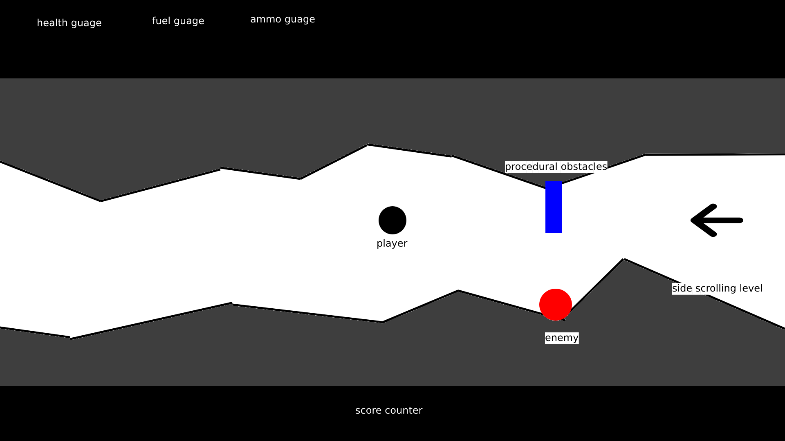

# Fat Helicopter Tech Spec

---

# **Fat Helicopter Game Design**

## **Overview**

Fat Helicopter is a side-scrolling, infinite-level arcade game where players control a heavy, unwieldy helicopter. The game focuses on balancing fuel, health, and ammunition while navigating obstacles and fighting enemies to progress through an endless series of levels with increasing difficulty.

## **1. Project Choice**

- **Option**: Web Game Design
- **Game Title**: “Fat Helicopter”

---

## **2. Purpose of the Game**

- **Goal**: Provide an engaging, skill-based arcade experience with a unique physics-based flight system. Players aim to survive as many levels as possible while competing on a global leaderboard.
- **Target Audience**:
    - **Age Group**: Ages 13 and up.
    - **Interests**: Casual gamers, fans of arcade and physics-based games.

---

## **3. Design**

# **A. Functionality**

### **Core Features**

1. **Flight System**:
    - Pressing “W” applies an upward force on the helicopter, depleting fuel.
    - Players adjust the angle of ascent using “A” and “D” keys, altering the direction within a 0-180 degree range.
    - A 2D physics engine simulates realistic gravitational pull, velocity, and acceleration for an immersive flight experience.
2. **Health System**:
    - The helicopter’s health decreases if it collides with the ground at high speed or takes damage from enemy fire.
    - Health pickups appear throughout levels to replenish health.
3. **Fuel System**:
    - The helicopter consumes fuel when “W” is pressed.
    - Players can collect fuel pickups to keep the helicopter airborne.
4. **Weapons Mechanics**:
    - Aiming is controlled by the mouse, which directs the helicopter’s turret.
    - Firing depletes the ammunition gauge, which can be replenished through pickups.
5. **Failure Mechanics**:
    - The game ends if the health or fuel gauge is depleted.
    - A failure screen appears, giving players the option to view their score and return to the main menu.
6. **Leaderboard**:
    - After each game, players can submit their score to a global leaderboard stored in a Firestore database.
    - The leaderboard displays the highest scores and ranks players globally.
7. **Level Progression**:
    - Players progress by moving the helicopter from the left to the right of each level.
    - Levels become progressively more challenging, adding complex obstacles and more aggressive enemies.
8. **Enemies**:
    - Anti-aircraft guns spawn in later levels, firing physics-based projectiles at the helicopter.
    - Players can defeat enemies by aiming and firing the turret to deplete enemy health.
9. **Loot System**:
    - Levels contain pickups for health, fuel, and ammunition.
    - Each pickup type replenishes the respective gauge, allowing players to continue their progress.

### **User Flow**

1. **Start Screen**:
    - Options: Start Game, Leaderboard, Instructions, Settings.
    - **Instructions**: Brief tutorial covering flight controls, fuel management, health, and enemy combat.
2. **Gameplay**:
    - Players use keyboard and mouse controls to maneuver the helicopter, manage resources, and engage in combat.
    - Levels progress as the player reaches the right end of the screen; difficulty increases as new levels generate.
3. **Game Over Screen**:
    - Displays the final score and provides options to submit the score to the leaderboard or return to the start screen.

### **Mechanics**

- **Flight Physics**: Pressing “W” applies force, counteracting gravity and altering flight trajectory based on angle.
- **Collision Detection**: The game monitors the helicopter’s interactions with the ground, obstacles, and enemies.
- **Resource Management**: Players manage fuel, health, and ammunition, balancing usage to survive as long as possible.
- **Enemy Interaction**: Enemies attack with projectiles that can be evaded or destroyed, adding to the game’s difficulty.

### **Interactive Elements**

- **HUD (Heads-Up Display)**:
    - **Fuel Gauge**: Shows current fuel level.
    - **Health Bar**: Indicates remaining health.
    - **Ammunition Counter**: Displays remaining ammunition.
    - **Score Counter**: Updates in real-time based on level progression and enemy kills.
- **Buttons**: Accessible at the start and game over screens (Start, Submit Score, Settings).

# B. Aesthetics

### **Visual Style**

- **Theme**: Retro-inspired arcade style with colorful, pixelated graphics for a nostalgic feel.
- **Imagery**:
    - **Helicopter**: A large, cartoonish helicopter with exaggerated proportions.
    - **Enemies**: Anti-aircraft guns with basic animations for shooting.
    - **Pickups**: Easily identifiable icons for health, fuel, and ammunition.

### **Color Scheme**

- **Palette**: Bright, contrasting colors for pickups and UI elements.
    - **Helicopter**: Bright colors with a metallic feel.
    - **Enemies**: Darker, aggressive tones.
    - **Pickups**: Vivid red (health), blue (fuel), and green (ammunition).

### **Typography**

- **Font Style**: Arcade-inspired, bold font for UI text.
- **Readability**: High contrast for clarity against dynamic backgrounds.

### **Layout**

- **Screen Arrangement**:
    - **Game Area**: Centralized for easy viewing.
    - **HUD**: Top corners for fuel, health, and ammunition; center-bottom for score.

### Wireframe

### Mockup

.png)

---

# **Technical Specifications**

### **1. Technology Stack**

- **Programming Language**: JavaScript
- **Frontend:** HTML5 and CSS3
- **Backend**: Firebase (for persistent leaderboard)

### **3. Data Model**

- **Levels**: Procedurally generated with varying obstacle patterns.
- **Leaderboard**: Stores player names and scores in Firestore, sorted by score.

### **5. Specific Functionalities**

### a. Flight System and Physics

- **Specification**: Use Matter.js to implement realistic helicopter movement, gravity, and adjustable flight angles.

### b. Resource Management

- **Specification**: Update HUD dynamically to reflect fuel, health, and ammunition levels; set limits for each gauge.

### c. Enemy Behavior and Combat

- **Specification**: Enemies aim based on player’s position, with projectiles following a physics-based trajectory.

### d. Scoring and Leaderboard

- **Specification**: Track score in real-time; upon game end, send score to Firebase and update leaderboard.

### e. User Interface

- **Specification**: HTML5/CSS3 for UI design; responsive layout for different screen sizes and device orientations.

### f. Procedural Level Generation

- **Specification**: Randomize obstacles, enemies, and pickups to increase difficulty with progression.